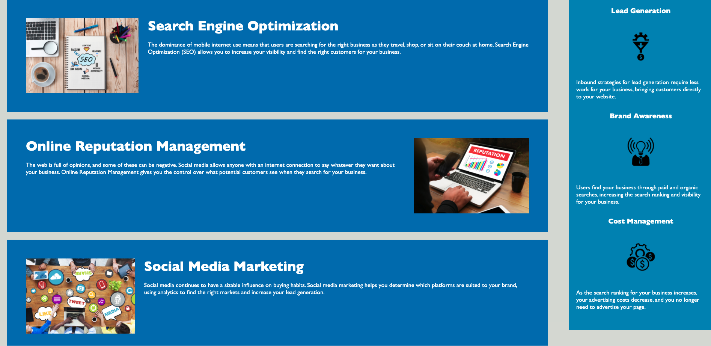

# horiseon-code-refactor

## Description

The Horiseon is a website that provides information on Search Engine Optimization, Online Reputation Management, and Social Media Marketing for your business. Horiseon also brings awareness to your Lead Generation, Brand Awareness, and Cost Management. The purpose for this project was to refactor the website so that it follows accessibility standards and that it is optimized for search engines. Throughout this project I have learned, in greater detail, about: adding Alt tags to images, adding semantic elements to html, and consolidating css selectors.

## Table of Contents

- [Acceptance_Criteria](#acceptance-criteria)

- [Installation](#installation)

- [credits](#credits)

- [Contributing](#contributing)

- [License](#license)

## Screenshots

Homework\horiseon-code-refractor\assets\images\Horiseon-Top-Part.png

Homework\horiseon-code-refractor\assets\images\Horiseon-Middle-Part

Homework\horiseon-code-refractor\assets\images\Horiseon-Bottom-Part.png

## Acceptance_Criteria

```
GIVEN a webpage meets accessibility standards
WHEN I view the source code
THEN I find semantic HTML elements
WHEN I view the structure of the HTML elements
THEN I find that the elements follow a logical structure independent of styling and positioning
WHEN I view the image elements
THEN I find accessible alt attributes
WHEN I view the heading attributes
THEN they fall in sequential order
WHEN I view the title element
THEN I find a concise, descriptive title
```

## Installation

dsds

## Credit

- https://github.com/GaTech55 David Brown for helping me with the READ.md file

- https://stackoverflow.com

- https://www.w3schools.com/

## Contributing

Pull requests are welcome. For major changes, please contact me first to discuss what you would like to change.

Follow the industry standard protocols [Contributor Covenant](https://www.contributor-covenant.org/)

## License

© 2019 Horiseon Social Solution Services, Inc.

© 2020 Austin Ellis.

Permission is hereby granted, free of charge, to any person obtaining a copy of this software and associated documentation files (the "Software"), to deal in the Software without restriction, including without limitation the rights to use, copy, modify, merge, publish, distribute, sublicense, and/or sell copies of the Software, and to permit persons to whom the Software is furnished to do so, subject to the following coditions:

the above copyright notice and this permission notice shall be included in all copies or substantial portions of the Software.

THE SOFTWARE IS PROVIDED "AS IS", WITHOUT WARRANTY OF ANY KIND, EXPRESS OR IMPLIED, INCLUDING BUT NOT LIMITED TO THE WARRANTIES OF MERCHANTABILITY, FITNESS, FOR A PARTICULAR PURPOSE AND MONINFRINGEMENT. IN NO EVENT SHALL THE AUTHORS OR COPYRIGHT HOLDERS BE LIABLE FOR ANY CLAIM, DAMAGES OR OTHER LIABILITY, WHETHER IN AN ACTION OF CONTRACT, TORT OR OTHERWISE, ARISING FROM, OUT OF OR IN CONNECTION WITH THE SOFTWARE OR THE USE OR OTHER DEALINGS IN THE SOFTWARE.
